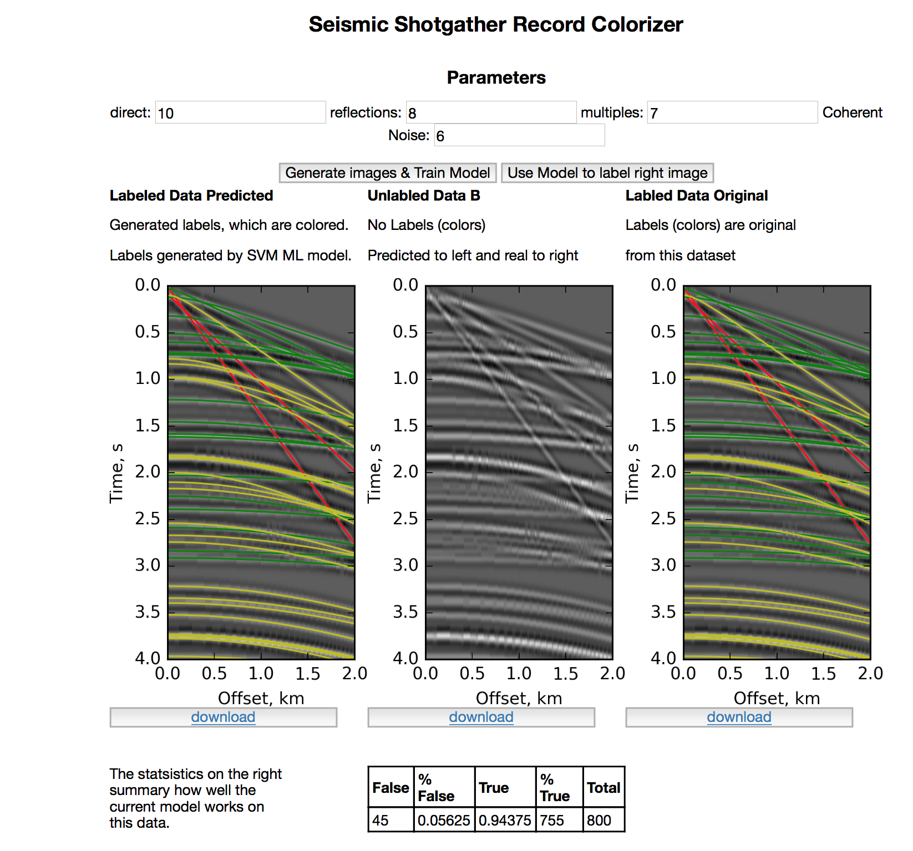

# hackathon2017
Hackathon 2017 project

### An Agile Scientific and Total Organized Geoscience Hackathon

### Project by ['Yuriy Ivanov', 'Anna Lim', 'Princy Ndong', 'Song Hou', 'Justin Gosses']

June 2017 Paris & virtually

# 'Seismic Shotgather Interpreter'
Teamname = 'Classy'

1. Generate synthetic seismic data with labels (direct energy, reflection, multiples, coherent noise)
2. Train a classifier using SVM
3. Generate Tests dataset
4. Draw interpreted lines
5. Test model prediction

### The final draft notebooks are below. 
The UI notebook runs the functions notebook.
- Project_hackathon_functions.ipynb
- User_Interface_v6_Final